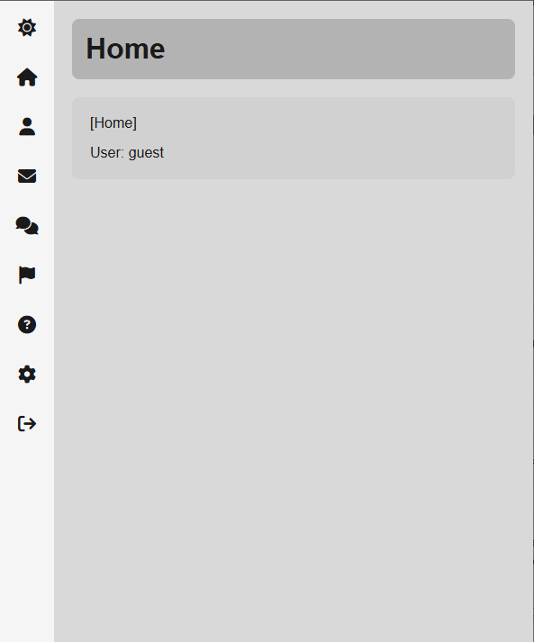
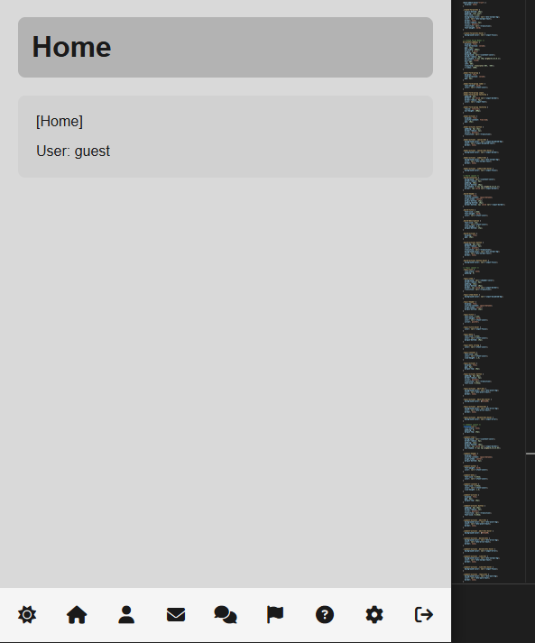

# minimal_module_js

# License: MIT

# Information:
  Work in progress. Using minimal packages in style vanilla js.

  Current Forum test build.

# Packages:
- vanjs
- uuid
- better-sqlite3
- nanoid
- hono
- @hono/node-server
- socket.io
- 

# Main Page:
- Home
- Blog
- Account
- Forum
- Novels
- Sign in
- Sign up
- Recovery

# Admin
- Server status
- Database
- Loggings
- Members
- Permissions
- Ban List
- Forums
- Novels
- Monitor
- Tickets
- Report

# Forum 

- Forum
    - Boards
        - Topic
        - Comments

# Novel
- Books
    - Book
        - Table of content
        - Next Page
        - Previst Page
- User books
  - Create book
  - Edit book
  - Books
      - Pages

# Images:

